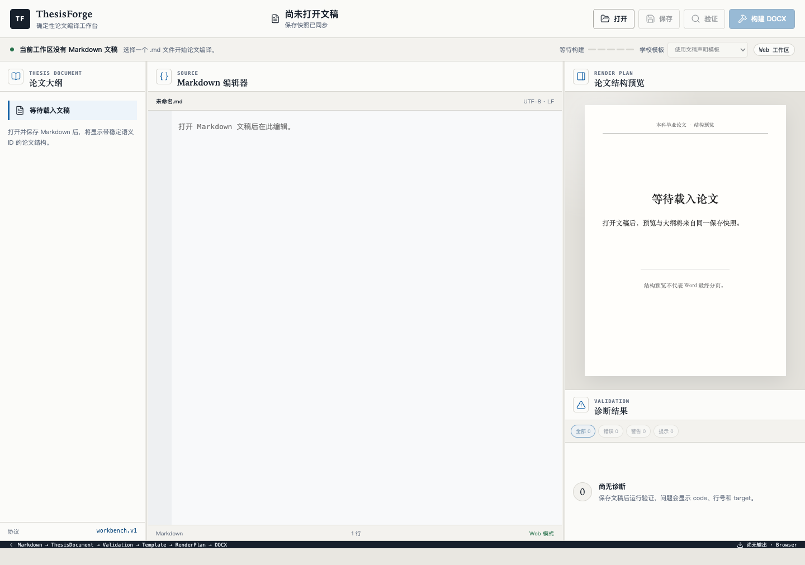
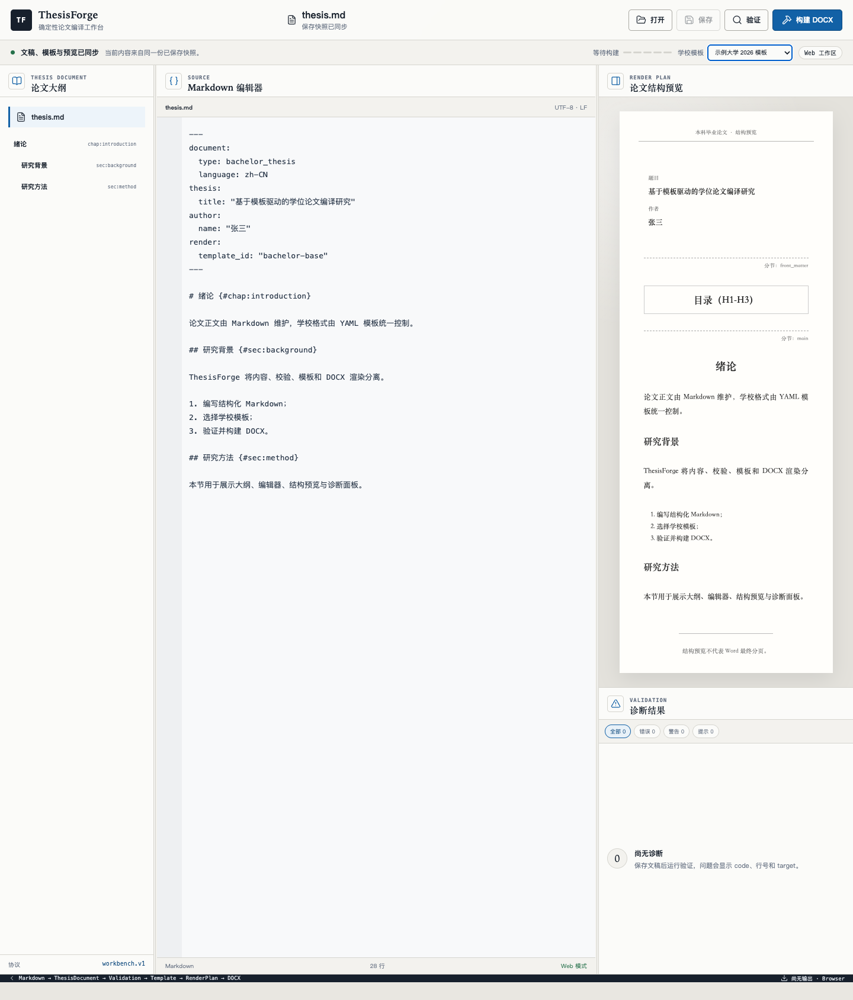
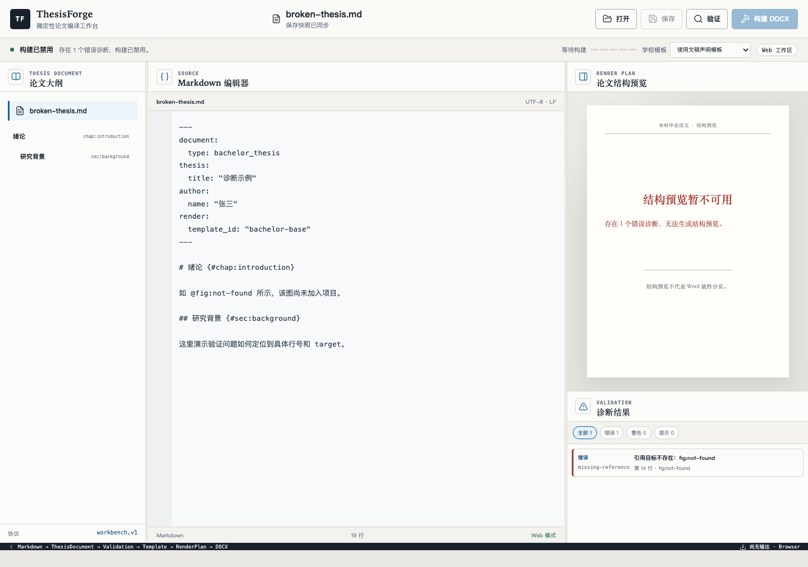
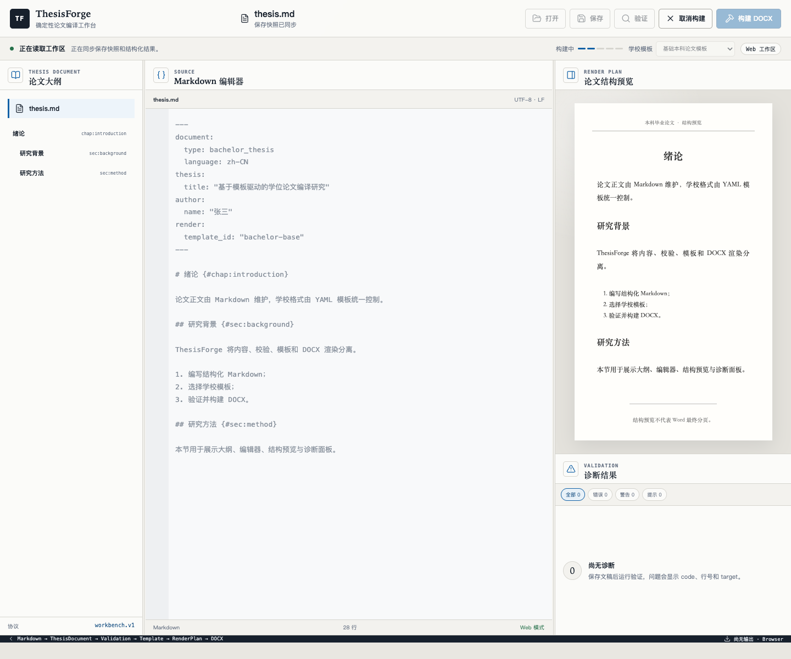
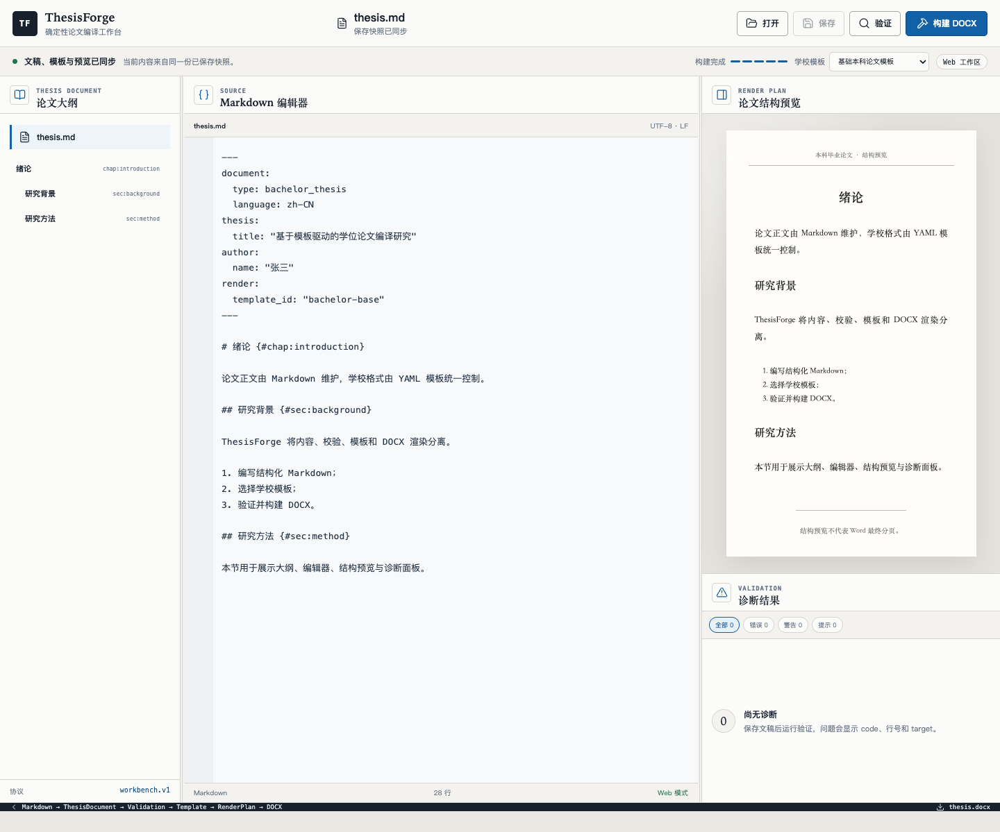
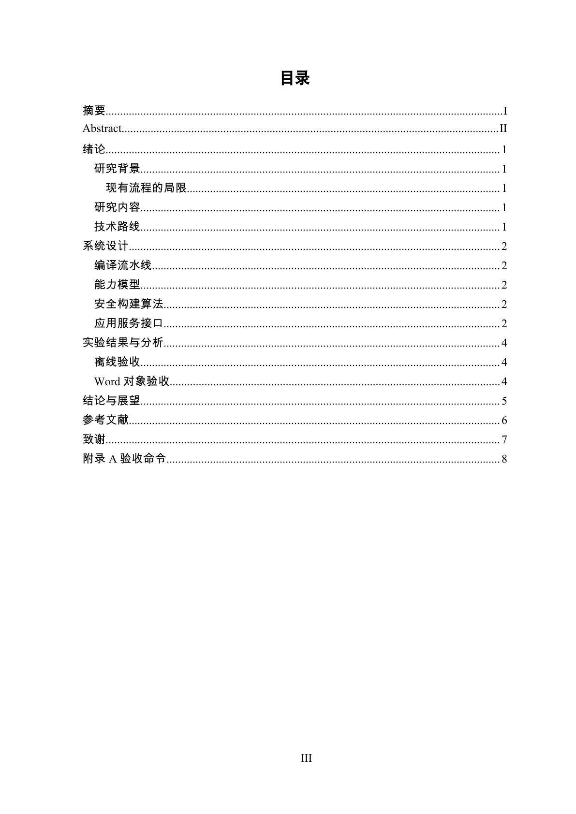

# DocForge 用户操作手册

> 适用范围：Web、macOS、Windows、命令行
> 文档基线：DocForge Word 优先实时 PDF 预览，2026-08-13
> 核心流程：Markdown → 校验 → 学校模板 → RenderPlan → DOCX → 可选最终版式 PDF

## 1. 先了解 DocForge

DocForge 将文档内容和格式分开管理：

- `document.md` 保存标题、章节、正文、图表、公式、引用等内容。
- `docforge.yaml` 保存项目元数据、资源路径、模板选择、布局覆盖、输出和 Review 路径。
- 学校 YAML 模板保存字体、字号、颜色、缩进、行距、页边距、目录、页码、页眉页脚等格式。
- 构建时，系统先解析和校验 Markdown，再应用模板，最后生成可编辑的 DOCX。

同一份 `document.md` 可以切换不同学校模板，不需要在正文中反复手工改字体和段落。



## 2. 选择使用方式

| 使用方式 | 适合场景 | Markdown 保存位置 | DOCX 获取方式 |
| --- | --- | --- | --- |
| Web | 浏览器试用、集中部署 | 上传后进入服务端工作区 | 当前界面只显示输出文件名，直接下载入口尚未接通 |
| macOS 桌面端 | 本机长期写作 | 原始本地文件 | 默认生成到 Markdown 同目录 |
| Windows 桌面端 | 本机长期写作 | 原始本地文件 | 默认生成到 Markdown 同目录 |
| CLI | 自动化、批量构建、调试模板 | 原始本地文件 | 使用 `-o` 指定输出路径 |

### 2.1 Web

1. 使用 Chrome、Edge 或 Safari 打开部署人员提供的 DocForge 地址。
2. Web 页面必须同时连接 DocForge Python HTTP adapter；只有 Vite 静态页面不能编译 DOCX。
3. 点击“打开”，选择包含 `docforge.yaml` 和 `document.md` 的项目目录，或直接选择 `docforge.yaml`。
4. 浏览器会把文稿上传到一个 Web 工作区。点击“保存”保存的是工作区副本，不会覆盖电脑上的原始 Markdown。

> **当前实现边界**
>
> Web 构建完成后，底部会显示 `document.docx`，但当前 HTTP adapter 没有提供下载路由，界面也没有可点击的下载按钮。需要实际取得文件时，请使用 macOS/Windows 桌面端或 CLI，或者由 Web 部署方增加工作区文件下载服务。

### 2.2 macOS

如果拿到的是 `.dmg`：

1. 双击打开 DMG。
2. 把 `DocForge.app` 拖入“应用程序”。
3. 启动 DocForge。
4. 点击“打开”，选择包含 `docforge.yaml` 的项目目录或 manifest。

当前开发构建可能未签名。正式发布版本应完成 Apple Developer ID 签名、公证和装订；不要把绕过系统安全提示作为标准安装步骤。

### 2.3 Windows

如果拿到的是 `.msi` 或 NSIS `.exe`：

1. 双击安装包。
2. 按安装向导完成安装。
3. 从开始菜单启动 DocForge。
4. 点击“打开”，选择包含 `docforge.yaml` 的项目目录或 manifest。

Windows 安装包必须在 Windows 原生环境构建。不能把 macOS 产物改名后当作 Windows 安装包。

### 2.4 CLI

源码环境安装：

```bash
python3.12 -m venv .venv
.venv/bin/python -m pip install --upgrade pip
make install
```

常用命令：

```bash
.venv/bin/docforge inspect examples/complete-thesis
.venv/bin/docforge validate examples/complete-thesis
.venv/bin/docforge review examples/complete-thesis --output-dir /tmp/docforge-review
.venv/bin/docforge build examples/complete-thesis \
  -o examples/complete-thesis/build/document.docx
```

## 3. 工作台界面

打开有效 DocForge 项目后，桌面宽度下分为四个主要区域：

1. 左侧“文档大纲”：显示标题和稳定 ID。
2. 中间“Markdown 编辑器”：编辑 `document.md`。
3. 右上“文档预览”：可切换快速“结构预览”和真实 PDF“最终版式”。
4. 右下“诊断结果”：显示错误、警告、提示、行号和 target。

顶部包含打开、保存、验证、构建 DOCX、构建进度和学校模板选择器。

“结构预览”来自 RenderPlan，适合检查标题、图表、公式、引用和语义结构，不代表
Microsoft Word 最终分页。“最终版式”显示真实 PDF 页面：

- macOS/Windows 桌面端只使用 Microsoft Word 生成实时预览，并标记为 `Microsoft Word PDF`。
- Web 自动预览标记为 `LibreOffice PDF`。
- 用户手工选择由 Microsoft Word 导出的 PDF 时同样标记为 `Microsoft Word PDF`。
- 修改 Markdown、切换模板或打开其他文稿后，旧 PDF 会显示“预览已过期”。


### 3.1 常用快捷键

| 操作 | macOS | Windows / Linux |
| --- | --- | --- |
| 聚焦编辑器 | `Cmd+K` | `Ctrl+K` |
| 保存 | `Cmd+S` | `Ctrl+S` |
| 构建 DOCX | `Cmd+B` | `Ctrl+B` |

### 3.2 为什么按钮有时不可用

- 没有打开 DocForge 项目：保存、验证、构建和模板选择不可用。
- 文稿有未保存修改：验证、构建和模板切换不可用，先保存。
- 存在错误诊断：构建不可用，先修复错误。
- 正在执行操作：部分按钮暂时锁定。
- 目标目录不可写：桌面端会显示权限错误，可修复权限后恢复工作区。

## 4. 创建文档项目

建议从仓库中的完整示例开始：

```text
examples/complete-thesis/
```

一个最小项目如下：

```text
my-document/
├── docforge.yaml
├── document.md
├── references.bib
├── images/
└── build/
```

`docforge.yaml`：

```yaml
schema: docforge.project.v1

project:
  id: my-document
  language: zh-CN

document:
  source: document.md
  type: academic

metadata:
  title:
    zh: "文档题目"
  authors:
    - name: "张三"

resources:
  root: .
  assets: images
  bibliography: references.bib

render:
  template_id: example-university-2026
```

`document.md`：

```markdown

# 绪论 {#chap:introduction}

这里是正文。

## 研究背景 {#sec:background}

这里是研究背景。
```

### 4.1 项目 manifest

项目入口固定为 `docforge.yaml`。它必须声明项目身份、`document.md` 源文件和模板；
元数据、资源、输出与 Review 路径也集中在该文件中。正文不再使用 Front Matter：

```yaml
schema: docforge.project.v1

project:
  id: my-thesis
  language: zh-CN

document:
  source: document.md
  type: academic

metadata:
  title:
    zh: "中文题目"
    en: "English Title"
  authors:
    - name: "张三"
  organization: "湖南工业大学"

academic:
  student:
    name: "张三"
    id: "2024000001"
  institution:
    name: "湖南工业大学"
    department: "计算机学院"
  degree:
    name: "工学硕士"
    major: "计算机科学与技术"
  advisor:
    name: "李老师"
    title: "教授"
  completion:
    date: "2026-06"

resources:
  root: .
  assets: images
  bibliography: references.bib

render:
  template_id: "hut-master-2026"
  citation_style: "GB-T-7714-2025"
```

选择的模板可以通过 `metadata.*` 和可选的 `academic.*` 绑定读取封面信息。常见
绑定路径包括 `metadata.title.zh`、`metadata.title.en`、`metadata.authors[].name`、
`metadata.organization`、`academic.student.*`、`academic.institution.*`、
`academic.degree.*`、`academic.advisor.*` 和 `academic.completion.date`。

### 4.2 标题和稳定 ID

```markdown
# 绪论 {#chap:introduction}
## 研究背景 {#sec:background}
### 国内研究现状
```

需要被引用的章、节必须有 ID：

```text
chap: 章
sec:  节
fig:  图
tbl:  表
eq:   公式
alg:  算法
lst:  代码清单
```

同一文档中的 ID 必须唯一。

### 4.3 正文和列表

普通连续文本会生成正文段落。列表使用标准 Markdown：

```markdown
1. 第一项；
2. 第二项；
   1. 第二级第一项。

- 无序项目；
  - 第二级项目。
```

列表文字写在 Markdown 中，编号样式、大小写、缩进和段落格式写在模板中。

### 4.4 图片

```markdown
{#fig:architecture}
```

正文引用：

```markdown
系统总体架构如 @fig:architecture 所示。
```

图片路径默认相对 Markdown 文件所在目录解析，不能使用 `..` 或符号链接逃逸到项目目录之外。

### 4.5 表格

```markdown
| 模型 | 准确率 |
| --- | ---: |
| A | 91.2% |
| B | 94.5% |
: 实验结果 {#tbl:results}
```

正文引用：

```markdown
实验结果见 @tbl:results。
```

### 4.6 公式

```markdown
$$
L=-\sum_i y_i \log \hat y_i
$$
{#eq:loss}
```

正文引用：

```markdown
损失函数如 @eq:loss 所示。
```

### 4.7 算法和代码清单

````markdown
```algorithm {#alg:train title="训练流程"}
1. 初始化参数；
2. 读取数据；
3. 前向计算；
4. 反向传播。
```

```python {#lst:predict title="预测函数"}
def predict(x):
    return model(x)
```
````

### 4.8 文献引用和参考文献

`docforge.yaml`：

```yaml
resources:
  bibliography: references.bib

render:
  citation_style: "GB-T-7714-2025"
```

正文引用：

```markdown
已有研究提出该方法 [@smith2025]。
多篇文献：[@smith2025; @wang2024]
带页码：[@smith2025, p. 12]
```

参考文献插入位置：

```markdown
# 参考文献 {#chap:bibliography}
```

### 4.9 脚注

```markdown
这里有一个说明。[^note]

[^note]: 这是脚注正文。
```

## 5. 选择学校模板

模板选择优先级：

1. 项目 `docforge.yaml` 中的 `render.template_id`。
2. 工作台学校模板选择器的显式选择。
3. 安装包内置模板或项目 `templates/` 中按 ID 匹配的模板。



工作台当前直接列出：

- 基础本科论文模板。
- 示例大学 2026 模板。
- “使用文稿声明模板”。

需要使用 HUT 或项目自定义模板时，在 `docforge.yaml` 写入模板 ID，然后在界面选择“使用文稿声明模板”：

```yaml
render:
  template_id: "hut-master-2026"
```

HUT P0 YAML 是当前实现和验收使用的模板示例，不替代学校官方格式文件的最终审定。源码已声明将它打入后续发布包，但旧 wheel 或旧桌面包可能尚未包含；如果出现 `missing-template`，请把当前 HUT YAML 放入项目 `templates/`，或重新构建当前版本安装包。

### 5.1 模板文件放在哪里

推荐项目结构：

```text
my-thesis/
├── docforge.yaml
├── document.md
├── references.bib
├── images/
└── templates/
    └── schools/
        └── my-university/
            └── 2026.yaml
```

按 ID 查找时，DocForge 从项目目录向上寻找最近的 `templates/`，再查找安装包内置模板。

> 工作台当前没有 YAML 模板编辑器，也没有“浏览并选择任意模板路径”的按钮。自定义模板请在项目目录中编辑，并在 `docforge.yaml` 的 `render.template_id` 中选择。

## 6. 配置论文格式

模板顶层结构：

```yaml
id: my-school-2026
name: 我的学校 2026 论文模板
year: 2026
page: {}
cover: {}
list: {}
body: {}
heading: {}
semantic_styles: {}
toc: {}
bibliography: {}
figure: {}
table: {}
equation: {}
sections: {}
citation: {}
```

### 6.1 单位和颜色

长度必须带单位：

```text
mm  cm  pt  em
```

示例：

```yaml
margin: 25mm
size: 12pt
first_line_indent: 2em
```

颜色使用 6 位十六进制，不带 `#`：

```yaml
color: "000000"
```

### 6.2 页面和页边距

```yaml
page:
  size: A4
  orientation: portrait
  margin:
    top: 25mm
    bottom: 25mm
    left: 30mm
    right: 25mm
  header_distance: 15mm
  footer_distance: 17.5mm
  document_grid:
    type: lines
    line_pitch: 20pt
```

页面尺寸支持 `A3`、`A4`、`A5`、`Letter`、`Legal`；方向支持 `portrait`、`landscape`。

### 6.3 正文

正文的首行缩进、段前段后、行距、颜色都可以配置：

```yaml
body:
  font:
    east_asia: 宋体
    latin: Times New Roman
  size: 12pt
  color: "000000"
  alignment: justify
  first_line_indent: 2em
  space_before: 0pt
  space_after: 0pt
  line_spacing:
    type: fixed
    value: 20pt
  widow_control: true
  snap_to_grid: true
```

行距写法：

```yaml
# 固定值
line_spacing:
  type: fixed
  value: 20pt

# 多倍行距
line_spacing:
  type: multiple
  value: 1.5

# 单倍行距
line_spacing:
  type: single
```

### 6.4 一级、二级、三级标题

```yaml
heading:
  level1:
    font: {east_asia: 黑体, latin: Times New Roman}
    size: 16pt
    color: "000000"
    bold: true
    alignment: left
    left_indent: 0pt
    first_line_indent: 0pt
    space_before: 0pt
    space_after: 12pt
    line_spacing: {type: fixed, value: 20pt}
    keep_with_next: true
    page_break_before: true
    outline_level: 0
  level2:
    font: {east_asia: 黑体, latin: Times New Roman}
    size: 14pt
    color: "000000"
    bold: true
    alignment: left
    left_indent: 0pt
    first_line_indent: 0pt
    space_before: 6pt
    space_after: 6pt
    line_spacing: {type: fixed, value: 20pt}
    outline_level: 1
  level3:
    font: {east_asia: 黑体, latin: Times New Roman}
    size: 12pt
    color: "000000"
    bold: true
    alignment: left
    left_indent: 0pt
    first_line_indent: 0pt
    space_before: 3pt
    space_after: 3pt
    line_spacing: {type: fixed, value: 20pt}
    outline_level: 2
```

标题要顶格时，设置：

```yaml
left_indent: 0pt
first_line_indent: 0pt
```

标题颜色要为黑色时，设置：

```yaml
color: "000000"
```

### 6.5 有序列表和罗马数字大小写

```yaml
list:
  ordered:
    levels:
      - format: decimal
        prefix: ""
        suffix: "、"
        alignment: right
        left_indent: 24pt
        hanging_indent: 18pt
      - format: upper_letter
        prefix: "("
        suffix: ")"
        alignment: right
        left_indent: 48pt
        hanging_indent: 18pt
      - format: upper_roman
        prefix: "("
        suffix: ")"
        alignment: right
        left_indent: 72pt
        hanging_indent: 18pt
  unordered:
    levels:
      - marker: "•"
        left_indent: 24pt
        hanging_indent: 18pt
```

有序列表 `format`：

```text
decimal
lower_letter
upper_letter
lower_roman
upper_roman
```

例如，把 `iii` 改成 `III`：

```yaml
format: upper_roman
```

### 6.6 目录

```yaml
toc:
  title:
    font: {east_asia: 黑体, latin: Times New Roman}
    size: 16pt
    color: "000000"
    bold: true
    alignment: center
    space_after: 12pt
  level1:
    font: {east_asia: 宋体, latin: Times New Roman}
    size: 12pt
    left_indent: 0pt
    first_line_indent: 0pt
    page_number_tab: 155mm
    leader: dots
  level2:
    size: 12pt
    left_indent: 1em
    first_line_indent: 0pt
    page_number_tab: 155mm
    leader: dots
  level3:
    size: 12pt
    left_indent: 2em
    first_line_indent: 0pt
    page_number_tab: 155mm
    leader: dots
```

`leader` 支持：

```text
none
dots
dashes
line
heavy
middle_dot
```

DocForge 生成真实 Word TOC 字段，不用普通文字伪造目录。

### 6.7 页码大小写和重新编号

```yaml
sections:
  cover:
    page_number:
      format: none

  front_matter:
    start: new_page
    page_number:
      format: roman-upper
      restart: 1
      display:
        alignment: center
        page_prefix: ""
        page_suffix: ""
        include_total: false

  main:
    start: odd_page
    page_number:
      format: decimal
      restart: 1
      display:
        alignment: center
        page_prefix: ""
        page_suffix: ""
        include_total: false
```

页码格式：

```text
decimal       1, 2, 3
roman-lower   i, ii, iii
roman-upper   I, II, III
none          不输出页码
```

### 6.8 页眉页脚

```yaml
sections:
  main:
    header:
      default:
        enabled: true
        text: 湖南工业大学硕士学位论文
        style:
          font: {east_asia: 宋体, latin: Times New Roman}
          size: 10.5pt
          alignment: center
        bottom_border:
          style: single
          width: 0.5pt
          color: auto
          space: 1pt
      even:
        enabled: true
        text: HUNAN UNIVERSITY OF TECHNOLOGY
      first:
        enabled: false
    footer:
      default:
        enabled: true
        page_number:
          alignment: center
          page_prefix: ""
          page_suffix: ""
          include_total: false
```

`default` 是普通页，`first` 是节首页，`even` 是偶数页。

### 6.9 图、表、公式

```yaml
figure:
  numbering: {mode: chapter, separator: "-"}
  caption:
    position: bottom
    prefix: 图
    font: {east_asia: 宋体, latin: Times New Roman}
    size: 10.5pt
    alignment: center
  default_width: 150mm

table:
  style: three_line
  three_line:
    top_width: 1.5pt
    header_width: 0.75pt
    bottom_width: 1.5pt
  numbering: {mode: chapter, separator: "-"}
  caption:
    position: top
    prefix: 表
    size: 10.5pt
    alignment: center

equation:
  numbering: {mode: chapter, separator: "-"}
  alignment: center
```

编号模式支持 `chapter`、`continuous`、`none`。表格样式支持 `three_line`、`grid`、`plain`。
三线表可通过 `top_width`、`header_width`、`bottom_width` 分别配置顶线、栏目线和底线；
常用论文格式为 `1.5pt / 0.75pt / 1.5pt`，具体以学校规范为准。

### 6.10 参考文献和文内引用

```yaml
bibliography:
  title:
    size: 16pt
    bold: true
    alignment: center
  entry:
    size: 10.5pt
    alignment: justify
    left_indent: 2em
    hanging_indent: 2em
    line_spacing: {type: fixed, value: 20pt}

citation:
  style: GB-T-7714-2025
  presentation: superscript
```

`presentation` 支持 `inline` 和 `superscript`。

### 6.11 模板校验规则

- 未知字段会直接报错，不会静默忽略。
- 长度必须带单位。
- `body.size` 和页边距等物理尺寸不能使用 `em`。
- `first_line_indent` 与正值 `hanging_indent` 不能同时设置。
- `multiple` 行距必须使用浮点数，例如 `1.5`，不要写整数 `1`。
- 论文使用图、表、公式或引用时，模板必须定义对应样式，否则会报告 `missing-template-style`。

## 7. 保存、验证和修复问题

推荐顺序：

1. 编辑 Markdown。
2. 点击“保存”。
3. 点击“验证”。
4. 查看右下角诊断。
5. 点击某条诊断，跳转到对应行。
6. 修复后再次保存和验证。
7. 错误数量为 0 后构建。



图中 `missing-reference` 表示正文引用了不存在的 `fig:not-found`。

常见问题：

| code / 现象 | 原因 | 处理方法 |
| --- | --- | --- |
| `missing-reference` | 引用了不存在的图、表、公式、章节 | 补充目标对象或修正 ID |
| `duplicate-id` | 两个对象使用同一个 ID | 修改其中一个 ID |
| `missing-image` | 图片文件不存在 | 检查 `src` 和图片目录 |
| `resource-path-escape` | 资源路径越出论文目录 | 把资源放回允许目录 |
| `missing-template` | 模板 ID 找不到 | 检查模板 ID、位置和扩展名 |
| `ambiguous-template` | 同一个 ID 匹配多个模板 | 删除或改名重复模板 |
| `missing-template-style` | 使用了模板未定义的语义对象 | 补充对应模板配置 |
| 构建按钮灰色 | 文稿未保存或仍有错误 | 先保存并消除错误 |

移动宽度下，通过“大纲 / 编辑 / 预览 / 诊断”标签切换面板。

## 8. 构建 DOCX

### 8.1 工作台构建

1. 确认状态为“文稿、模板与预览已同步”。
2. 确认错误诊断为 0。
3. 点击“构建 DOCX”。
4. 观察五个阶段：

```text
解析 → 验证 → 编译 → 渲染 → 完成
```



构建完成后，底部显示输出文件名：



### 8.2 macOS / Windows 在哪里找 DOCX

桌面端默认把 DOCX 写到项目 `output.directory` 指定的目录：

```text
/path/to/project/document.md
/path/to/project/build/document.docx
```

打开项目目录或 manifest 中的输出目录即可找到。

### 8.3 Web 如何下载

当前版本 Web 工作台会构建服务端工作区中的 DOCX，并返回 `document.docx` 文件名，但尚未实现浏览器下载端点和下载按钮。

在下载能力补齐前，可选择：

1. 使用 macOS/Windows 桌面端构建。
2. 使用 CLI 构建并用 `-o` 指定本地文件。
3. 由 Web 部署人员从工作区存储中导出。

不要把底部显示的 `document.docx` 当作浏览器已经下载完成。

### 8.4 CLI 构建

```bash
.venv/bin/docforge validate my-thesis
.venv/bin/docforge build my-thesis -o my-thesis/build/document.docx
```

DocForge 先写同目录临时文件，校验 DOCX 包后再原子替换最终输出。取消或失败时，已有的上一份有效 DOCX 应保持不变。

### 8.5 查看最终版式 PDF

1. 点击右侧“最终版式”。
2. 正常构建 DOCX。
3. 桌面端调用本机 Microsoft Word 生成 PDF，不切换到其他 Office 引擎。
4. 构建完成后会读取同目录派生文件：

```text
/path/to/project/build/document.docx
/path/to/project/build/document.preview.pdf
```

桌面界面显示 `Microsoft Word PDF` 并标记为“当前 Office 预览”。Web 自动预览仍只
使用 LibreOffice；Web 预览只代表 Web 运行环境的排版结果。

macOS 首次通过 DocForge 调用 Microsoft Word 时，系统可能要求一次“自动化”权限。
允许 DocForge 控制 Microsoft Word 后，后续实时预览通常不再重复弹出文件授权。
如果曾拒绝，可在“系统设置 → 隐私与安全性 → 自动化”中重新允许。

如果 Microsoft Word 未生成 PDF，DOCX 仍然构建成功。请检查 macOS“自动化”权限后
重新构建，或点击“选择 Office PDF”关联一个已由 Microsoft Word 导出的 `.pdf` 文件。

### 8.6 Office PDF 和过期状态

在 Microsoft Word 中打开最新 DOCX，完成目录更新和人工检查后导出 PDF，再在
DocForge“最终版式”中点击“选择 Office PDF”。Web 使用浏览器文件选择器，
macOS/Windows 桌面端使用原生 PDF 选择器。

手工选择的文件标记为 `Microsoft Word PDF`。以下操作会让当前 PDF 显示“已过期”：

- 修改 `document.md` 或 `docforge.yaml`。
- 切换学校模板。
- 打开另一份 DocForge 项目。

过期 PDF 仍可查看，但不能作为当前文稿的最新验收证据。重新构建后恢复为“当前构建”；
重新选择 Office PDF 后显示“当前 Office 预览”，避免把手工关联文件误写为本次构建产物。

## 9. 自动目录和页码

DocForge 生成真实 Word TOC 字段、PAGE 字段和节页码格式。



### 9.1 自动刷新

构建服务默认尝试调用本机 LibreOffice 计算目录条目和页码：

```text
DOCFORGE_OFFICE_REFRESH=auto
```

如果 LibreOffice 未安装、连接失败或超时，构建仍会保留有效 DOCX 和 dirty TOC 字段，不会用损坏文件覆盖输出。

### 9.2 手动更新目录

在 Microsoft Word 中：

1. 打开 DOCX。
2. 点击目录。
3. 右键选择“更新域”或“更新目录”。
4. 选择“更新整个目录”。

也可以全选文档后更新域；不同系统和软件版本的快捷键可能不同。

## 10. Web、macOS、Windows 差异

| 能力 | Web | macOS | Windows |
| --- | --- | --- | --- |
| 打开项目 | 选择 `docforge.yaml` 项目 | 原生项目选择 | 原生项目选择 |
| 保存 Markdown | 保存 Web 工作区副本 | 写回原始本地文件 | 写回原始本地文件 |
| 自定义模板 ID | `docforge.yaml` | `docforge.yaml` | `docforge.yaml` |
| 任意模板路径 | 项目 `templates/` | 项目 `templates/` | 项目 `templates/` |
| DOCX 输出 | 服务端工作区 | Markdown 同目录 | Markdown 同目录 |
| DOCX 直接下载 | 当前未接通 | 不需要下载 | 不需要下载 |
| 自动最终预览 | 工作区 `LibreOffice PDF` | 本机 `Microsoft Word PDF` | 本机 `Microsoft Word PDF` |
| 选择 Office PDF | 浏览器文件选择 | 原生文件选择 | 原生文件选择 |
| 编译核心 | Python HTTP adapter | Tauri + 本地 sidecar | Tauri + 本地 sidecar |
| 离线使用 | 取决于部署方式 | 支持 | 支持 |

## 11. 常见问题

### 11.1 保存后本地 Markdown 没变化

如果使用 Web，这是当前设计：保存的是服务端工作区副本。需要直接编辑本地文件时使用桌面端或本地编辑器。

### 11.2 模板下拉框没有我的学校

把模板放入项目 `templates/`，在 `docforge.yaml` 写 `render.template_id`，界面选择“使用文稿声明模板”。

### 11.3 结构预览和 Word 分页不同

这是正常现象。结构预览用于检查语义结构和模板角色，不执行 Microsoft Word 的最终
分页算法。需要检查真实页面时切换到“最终版式”。桌面端自动 PDF 反映 Microsoft Word
的实际布局，Web 自动 PDF 反映 Web 运行环境中 LibreOffice 的布局。

### 11.4 目录是空的或页码没有更新

先在 Word、WPS 或 LibreOffice 中更新整个目录。若希望构建时预填，安装兼容的 LibreOffice 和 UNO Python，并保持 `DOCFORGE_OFFICE_REFRESH=auto`。

### 11.5 `iii` 如何改成 `III`

列表编号：

```yaml
format: upper_roman
```

前置部分页码：

```yaml
page_number:
  format: roman-upper
```

### 11.6 标题为什么不是黑色或没有顶格

```yaml
heading:
  level1:
    color: "000000"
    alignment: left
    left_indent: 0pt
    first_line_indent: 0pt
```

### 11.7 首行缩进、段前段后、行间距能否配置

可以，配置在 `body` 或具体语义角色中：

```yaml
first_line_indent: 2em
space_before: 0pt
space_after: 0pt
line_spacing:
  type: fixed
  value: 20pt
```

## 12. 推荐的完整操作流程

1. 复制 `examples/complete-thesis/` 作为文档项目。
2. 修改 `docforge.yaml` 中的元数据、资源和模板配置。
3. 准备 `references.bib` 和 `images/`。
4. 选择或创建学校 YAML 模板。
5. 在工作台打开包含 `docforge.yaml` 的项目。
6. 检查大纲和结构预览。
7. 编辑后保存。
8. 运行验证，清除所有错误。
9. 构建 DOCX。
10. 切换“最终版式”，桌面端检查标记为 `Microsoft Word PDF` 的真实页面。
11. 在 Microsoft Word 中更新整个目录。
12. 检查封面、摘要、目录、正文、图表、公式、参考文献、页眉页脚和页码。
13. 最终提交前重新构建一次，并保留 Markdown、模板、BibTeX、图片、DOCX 和验收 PDF。

## 13. 提交前检查清单

- [ ] `docforge.yaml` 中题目、作者、学院、专业、导师和日期正确。
- [ ] `render.template_id` 指向正确学校模板。
- [ ] 图、表、公式、算法、代码清单 ID 唯一。
- [ ] 所有交叉引用都能解析。
- [ ] 图片和 BibTeX 路径存在且未越界。
- [ ] 验证结果无错误。
- [ ] 正文首行缩进、段距和行距符合学校要求。
- [ ] 一级至三级标题颜色、缩进、分页和大纲级别正确。
- [ ] 目录层级、点引导符和页码正确。
- [ ] 前置页页码大小写正确，正文页码从 1 重新开始。
- [ ] 页眉页脚、奇偶页和首页策略正确。
- [ ] 图题、表题、公式编号和交叉引用正确。
- [ ] 参考文献格式和悬挂缩进正确。
- [ ] 最终版式标签与实际引擎一致，且未显示“已过期”。
- [ ] 最终 DOCX 已在目标 Office 软件中人工检查。

## 14. 进一步参考

- Markdown 语法权威说明：`docs/MARKDOWN_SPEC.md`
- 模板字段权威说明：`docs/TEMPLATE_SPEC.md`
- 完整文档示例：`examples/complete-thesis/document.md`
- HUT 模板示例：`templates/schools/hunan-university-of-technology/master-2026.yaml`
- 维护与打包：`docs/MAINTENANCE.md`
