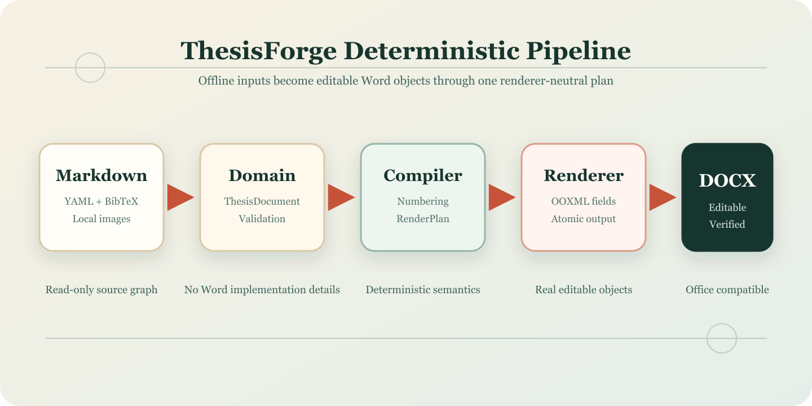

# 摘要 {#chap:abstract-zh}

本文设计并实现一种本地优先、确定性、模板驱动的学位论文编译器。系统将 Markdown 解析为与 Word 实现无关的论文领域模型，经结构化验证、模板解析与统一编译后生成可编辑 DOCX。验收结果表明，该方案能够离线完成正文、摘要、关键词、目录、图表、公式、交叉引用、脚注、参考文献和奇偶页眉页脚的确定性编译。

关键词：Markdown；论文编译；OOXML；确定性构建

# Abstract {#chap:abstract-en}

This thesis presents a local-first, deterministic and template-driven compiler for structured academic documents. Markdown is parsed into a renderer-neutral domain model, validated against a school template, compiled into a stable render plan and rendered as an editable DOCX package with real Word objects.

Keywords: Markdown; thesis compiler; OOXML; deterministic build

# 绪论 {#chap:introduction}

## 研究背景 {#sec:background}

传统 Word 排版要求作者反复调整正文、标题、图表编号、公式和参考文献。结构化学术文档方法能够降低内容与版式的耦合 [@ref-example-1]，而确定性编译进一步提高了重复构建的可验证性 [@ref-example-2]。[^determinism]

### 现有流程的局限 {#sec:limitations}

手工排版容易在章节调整后产生编号、目录、交叉引用和页眉页脚不一致的问题。模板驱动编译把学校规则集中在强类型 YAML 中，使同一论文内容可以在不修改 Markdown 的情况下切换版式。

## 研究内容 {#sec:scope}

本文围绕以下内容展开：

1. 定义可验证的结构化 Markdown 输入；
2. 建立与 Word 无关的论文领域模型；
3. 通过模板解析正文和特殊章节版式；
4. 生成包含真实 OOXML 对象的 DOCX。

## 技术路线 {#sec:technical-route}

系统总体架构如 @fig:architecture 所示。

{#fig:architecture}

# 系统设计 {#chap:design}

## 编译流水线 {#sec:pipeline}

系统采用 Markdown -> ForgeDocument -> Validation -> Template -> RenderPlan -> DOCX 的单向编译链路，其抽象关系见 @eq:pipeline。

$$
D_{docx} = R(C(V(P(D_{md}))))
$$
{#eq:pipeline}

## 能力模型 {#sec:capabilities}

P0 核心能力见 @tbl:capabilities。

| 能力 | 输入 | DOCX 输出 |
| --- | --- | --- |
| 正文与特殊章节 | Markdown 语义段落 | 模板驱动 Word 样式 |
| 图 | 本地图片 | Drawing、题注与书签 |
| 表 | Markdown 表格 | 三线表、题注与书签 |
| 公式 | LaTeX 子集 | OMML、编号与书签 |
| 引用 | BibTeX key | 上标顺序编码引用 |

: DocForge P0 核心能力 {#tbl:capabilities}

## 安全构建算法 {#sec:safe-build}

安全构建流程见 @alg:build。

```algorithm {#alg:build title="安全构建流程"}
1. 解析并验证本地输入；
2. 编译 renderer-neutral RenderPlan；
3. 渲染到目标目录临时文件；
4. 校验 DOCX ZIP 与核心 XML；
5. 原子替换最终输出。

```

## 应用服务接口 {#sec:application-service}

核心服务接口示意见 @lst:service。

```python {#lst:service title="安全构建服务调用"}
result = build_service(
    source="document.md",
    output="build/document.docx",
)
```

# 实验结果与分析 {#chap:results}

## 离线验收 {#sec:offline-acceptance}

在禁用网络连接并移除 AI 服务凭据后，inspect、validate 与 build 均只读取本地 Markdown、YAML、BibTeX 和图片资源。重复构建生成的 ZIP 元数据可以不同，但 RenderPlan 和规范化 Word XML 保持一致。

## Word 对象验收 {#sec:word-acceptance}

验收包包含真实目录字段、图表与公式编号字段、交叉引用字段、页码字段、OMML、脚注、页眉页脚及多个节。图 @fig:architecture、表 @tbl:capabilities 和式 @eq:pipeline 均可在 Word 客户端中继续编辑。

# 结论与展望 {#chap:conclusion}

本文完成了 DocForge P0 模板化编译链和端到端验收。系统在不依赖网络或 AI 服务的条件下生成可编辑 DOCX，并以结构化测试验证正文、摘要、关键词、目录、参考文献和奇偶页眉页脚等关键格式。

# 参考文献 {#chap:bibliography}

# 致谢 {#chap:acknowledgements}

感谢指导教师和同学在系统设计、文档验证与兼容性测试过程中提供的帮助。

# 附录 A 验收命令 {#chap:appendix-a}

本附录记录完整样例使用的离线命令：

1. docforge inspect .
2. docforge validate .
3. docforge build . -o build/document.docx

[^determinism]: 确定性构建指相同输入、模板和依赖版本产生一致的 RenderPlan、编号、引用、字段、章节结构和规范化 OOXML。
